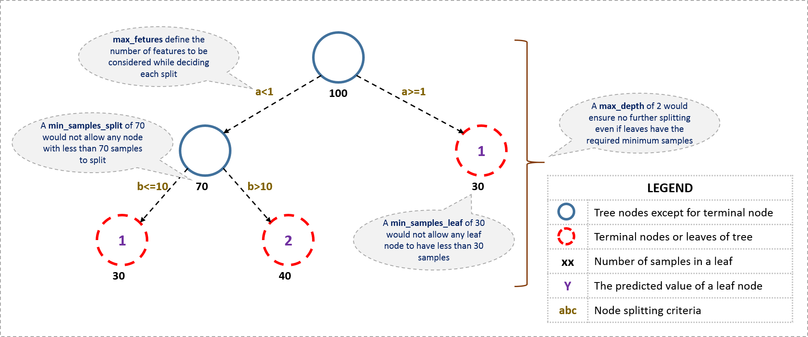

# Complete Guide to Parameter Tuning in Gradient Boosting (GBM) in Python

[__AARSHAY JAIN__](https://www.analyticsvidhya.com/blog/author/aarshay/)__, FEBRUARY 21, 2016__

[__LOGIN TO BOOKMARK THIS ARTICLE__](https://id.analyticsvidhya.com/accounts/login/?next=https://www.analyticsvidhya.com/blog/2016/02/complete-guide-parameter-tuning-gradient-boosting-gbm-python/)

## Introduction

This article is inspired by Owen Zhang’s (Chief Product Officer at DataRobot and Kaggle Rank 3) approach shared at [NYC Data Science Academy](http://nycdatascience.com/featured-talk-1-kaggle-data-scientist-owen-zhang/). He delivered a \~2 hours talk and I intend to condense it and present the most precious nuggets here.


Boosting algorithms play a crucial role in dealing with bias variance trade-off. Unlike bagging algorithms, which only controls for high variance in a model, boosting controls both the aspects (bias & variance), and is considered to be more effective.  A sincere understanding of GBM here should give you much needed confidence to deal with such critical issues. 

## 1. How Boosting Works ?

Boosting is a sequential technique which works on the principle of __ensemble__. It combines a set of __weak learners__ and delivers improved prediction accuracy. At any instant `t`, the model outcomes are weighed based on the outcomes of previous instant `t-1`. The outcomes predicted correctly are given a lower weight and the ones miss-classified are weighted higher. This technique is followed for a classification problem while a similar technique is used for regression.


Let’s understand it visually:


Observations:

1. __Box 1: Output of First Weak Learner (From the left)__

    * Initially all points have same weight (denoted by their size).
    * The decision boundary predicts 2 +ve and 5 -ve points correctly.

2. __Box 2: Output of Second Weak Learner__

    * The points classified correctly in box 1 are given a lower weight and vice versa.
    * The model focuses on high weight points now and classifies them correctly. But, others are misclassified now.

Similar trend can be seen in box 3 as well. This continues for many iterations. In the end, all models are given a weight depending on their accuracy and a consolidated result is generated.


Did I whet your appetite ? Good. Refer to these articles (focus on GBM right now):

> [Learn Gradient Boosting Algorithm for better predictions (with codes in R)<br>Quick Introduction to Boosting Algorithms in Machine Learning<br>Getting smart with Machine Learning – AdaBoost and Gradient Boost](https://www.analyticsvidhya.com/blog/2015/09/complete-guide-boosting-methods/)

## 2. GBM Parameters

The overall parameters can be divided into 3 categories:

1. __Tree-Specific Parameters:__ These affect each individual tree in the model.
2. __Boosting Parameters:__ These affect the boosting operation in the model.
3. __Miscellaneous Parameters:__ Other parameters for overall functioning.

I’ll start with tree-specific parameters. First, lets look at the general structure of a decision tree:



The parameters used for defining a tree are further explained below. Note that I’m using scikit-learn (python) specific terminologies here which might be different in other software packages like R. But the idea remains the same.

1. __min_samples_split__

    * Defines the minimum number of samples (or observations) which are required in a node to be considered for splitting.
    * Used to control over-fitting. Higher values prevent a model from learning relations which might be highly specific to the particular sample selected for a tree.
    * Too high values can lead to under-fitting hence, it should be tuned using CV.

2. __min_samples_leaf__

    * Defines the minimum samples (or observations) required in a terminal node or leaf.
    * Used to control over-fitting similar to min_samples_split.
    * Generally lower values should be chosen for imbalanced class problems because the regions in which the minority class will be in majority will be very small.

3. __min_weight_fraction_leaf__

    * Similar to min_samples_leaf but defined as a fraction of the total number of observations instead of an integer.
    * Only one of #2 and #3 should be defined.

4. __max_depth__

    * The maximum depth of a tree.
    * Used to control over-fitting as higher depth will allow model to learn relations very specific to a particular sample.
    * Should be tuned using CV.

5. __max_leaf_nodes__

    * The maximum number of terminal nodes or leaves in a tree.
    * Can be defined in place of max_depth. Since binary trees are created, a depth of ‘n’ would produce a maximum of 2^n leaves.
    * If this is defined, GBM will ignore max_depth.

6. __max_features__

    * The number of features to consider while searching for a best split. These will be randomly selected.
    * As a thumb-rule, square root of the total number of features works great but we should check up to 30-40% of the total number of features.
    * Higher values can lead to over-fitting but depends on case to case.

Before moving on to other parameters, lets see the overall pseudo-code of the GBM algorithm for 2 classes:

```
1. Initialize the outcome

2. Iterate from 1 to total number of trees

  2.1 Update the weights for targets based on previous run (higher for the ones mis-classified)

  2.2 Fit the model on selected subsample of data

  2.3 Make predictions on the full set of observations

  2.4 Update the output with current results taking into account the learning rate

3. Return the final output.
```

This is an extremely simplified (probably naive) explanation of GBM’s working. The parameters which we have considered so far will affect step 2.2, i.e. model building. Lets consider another set of parameters for managing boosting:

1. __learning_rate__

    * This determines the impact of each tree on the final outcome (step 2.4). GBM works by starting with an initial estimate which is updated using the output of each tree. The learning parameter controls the magnitude of this change in the estimates.
    * Lower values are generally preferred as they make the model robust to the specific characteristics of tree and thus allowing it to generalize well.
    * Lower values would require higher number of trees to model all the relations and will be computationally expensive.

2. __n_estimators__

    * The number of sequential trees to be modeled (step 2)
    * Though GBM is fairly robust at higher number of trees but it can still overfit at a point. Hence, this should be tuned using CV for a particular learning rate.

3. __subsample__

    * The fraction of observations to be selected for each tree. Selection is done by random sampling.
    * Values slightly less than 1 make the model robust by reducing the variance.
    * Typical values \~0.8 generally work fine but can be fine-tuned further.

Apart from these, there are certain miscellaneous parameters which affect overall functionality:

1. __loss__

    * It refers to the loss function to be minimized in each split.
    * It can have various values for classification and regression case. Generally the default values work fine. Other values should be chosen only if you understand their impact on the model.

2. __init__

    * This affects initialization of the output.
    * This can be used if we have made another model whose outcome is to be used as the initial estimates for GBM.

3. __random_state__

    * The random number seed so that same random numbers are generated every time.
    * This is important for parameter tuning. If we don’t fix the random number, then we’ll have different outcomes for subsequent runs on the same parameters and it becomes difficult to compare models.
    * It can potentially result in overfitting to a particular random sample selected. We can try running models for different random samples, which is computationally expensive and generally not used.

4. __verbose__

    * The type of output to be printed when the model fits. The different values can be:
        * 0: no output generated (default)
        * 1: output generated for trees in certain intervals
        * \>1: output generated for all trees

5. __warm_start__

    * This parameter has an interesting application and can help a lot if used judicially.
    * Using this, we can fit additional trees on previous fits of a model. It can save a lot of time and you should explore this option for advanced applications

6. __presort __

    * Select whether to presort data for faster splits.
    * It makes the selection automatically by default but it can be changed if needed.

I know its a long list of parameters but I have simplified it for you in an excel file which you can download from my [GitHub repository](https://github.com/aarshayj/Analytics_Vidhya/tree/master/Articles/Parameter_Tuning_GBM_with_Example).

## 3. Parameter Tuning with Example

We will take the dataset from Data Hackathon 3.x AV hackathon. The details of the problem can be found on the [competition page](http://datahack.analyticsvidhya.com/contest/data-hackathon-3x). You can download the data set from [here](https://www.analyticsvidhya.com/wp-content/uploads/2016/02/Dataset.rar). I have performed the following steps:

1. City variable dropped because of too many categories
2. DOB converted to Age | DOB dropped
3. EMI_Loan_Submitted_Missing created which is 1 if EMI_Loan_Submitted was missing else 0 | Original variable EMI_Loan_Submitted dropped
4. EmployerName dropped because of too many categories
5. Existing_EMI imputed with 0 (median) since only 111 values were missing
6. Interest_Rate_Missing created which is 1 if Interest_Rate was missing else 0 | Original variable Interest_Rate dropped
7. Lead_Creation_Date dropped because made little intuitive impact on outcome
8. Loan_Amount_Applied, Loan_Tenure_Applied imputed with median values
9. Loan_Amount_Submitted_Missing created which is 1 if Loan_Amount_Submitted was missing else 0 | Original variable Loan_Amount_Submitted dropped
10. Loan_Tenure_Submitted_Missing created which is 1 if Loan_Tenure_Submitted was missing else 0 | Original variable Loan_Tenure_Submitted dropped
11. LoggedIn, Salary_Account dropped
12. Processing_Fee_Missing created which is 1 if Processing_Fee was missing else 0 | Original variable Processing_Fee dropped
13. Source – top 2 kept as is and all others combined into different category
14. Numerical and One-Hot-Coding performed

For those who have the original data from competition, you can check out these steps from the data_preparation iPython notebook in the repository.

Lets start by importing the required libraries and loading the data:

```python
#Import libraries:
import pandas as pd
import numpy as np
from sklearn.ensemble import GradientBoostingClassifier  #GBM algorithm
from sklearn import cross_validation, metrics   #Additional scklearn functions
from sklearn.grid_search import GridSearchCV   #Perforing grid search

import matplotlib.pylab as plt
%matplotlib inline
from matplotlib.pylab import rcParams
rcParams['figure.figsize'] = 12, 4

train = pd.read_csv('train_modified.csv')
target = 'Disbursed'
IDcol = 'ID'
```

Before proceeding further, lets define a function which will help us create GBM models and perform cross-validation.

```python
def modelfit(alg, dtrain, predictors, performCV=True, printFeatureImportance=True, cv_folds=5):
    # Fit the algorithm on the data
    alg.fit(dtrain[predictors], dtrain['Disbursed'])

    # Predict training set:
    dtrain_predictions = alg.predict(dtrain[predictors])
    dtrain_predprob = alg.predict_proba(dtrain[predictors])[:,1]

    # Perform cross-validation:
    if performCV:
        cv_score = cross_validation.cross_val_score(alg, dtrain[predictors], dtrain['Disbursed'], cv=cv_folds, scoring='roc_auc')

    # Print model report:
    print "\nModel Report"
    print "Accuracy : %.4g" % metrics.accuracy_score(dtrain['Disbursed'].values, dtrain_predictions)
    print "AUC Score (Train): %f" % metrics.roc_auc_score(dtrain['Disbursed'], dtrain_predprob)

    if performCV:
        print "CV Score : Mean - %.7g | Std - %.7g | Min - %.7g | Max - %.7g" % (np.mean(cv_score),np.std(cv_score),np.min(cv_score),np.max(cv_score))

    # Print Feature Importance:
    if printFeatureImportance:
        feat_imp = pd.Series(alg.feature_importances_, predictors).sort_values(ascending=False)
        feat_imp.plot(kind='bar', title='Feature Importances')
        plt.ylabel('Feature Importance Score')
```

The code is pretty self-explanatory. Please feel free to drop a note in the comments if you find any challenges in understanding any part of it.

Lets start by creating a __baseline model__. In this case, the evaluation metric is AUC so using any constant value will give 0.5 as result. Typically, a good baseline can be a GBM model with default parameters, i.e. without any tuning. Lets find out what it gives:

```python
# Choose all predictors except target & IDcols
predictors = [x for x in train.columns if x not in [target, IDcol]]
gbm0 = GradientBoostingClassifier(random_state=10)
modelfit(gbm0, train, predictors)
```


So, the mean CV score is 0.8319 and we should expect our model to do better than this.
 
### General Approach for Parameter Tuning

As discussed earlier, there are two types of parameter to be tuned here – tree based and boosting parameters. There are no optimum values for learning rate as low values always work better, given that we train on sufficient number of trees.

Though, GBM is robust enough to not overfit with increasing trees, but a high number for pa particular learning rate can lead to overfitting. But as we reduce the learning rate and increase trees, the computation becomes expensive and would take a long time to run on standard personal computers.

Keeping all this in mind, we can take the following approach:

1. Choose a relatively __high learning rate__. Generally the default value of 0.1 works but somewhere between 0.05 to 0.2 should work for different problems
2. Determine the __optimum number of trees for this learning rate__. This should range around 40-70. Remember to choose a value on which your system can work fairly fast. This is because it will be used for testing various scenarios and determining the tree parameters.
3. __Tune tree-specific parameters__ for decided learning rate and number of trees. Note that we can choose different parameters to define a tree and I’ll take up an example here.
4. __Lower the learning rate__ and increase the estimators proportionally to get more robust models.
 
### Fix learning rate and number of estimators for tuning tree-based parameters

In order to decide on boosting parameters, we need to set some initial values of other parameters. Lets take the following values:

1. __min_samples_split = 500__: This should be ~0.5-1% of total values. Since this is imbalanced class problem, we’ll take a small value from the range.
2. __min_samples_leaf = 50__: Can be selected based on intuition. This is just used for preventing overfitting and again a small value because of imbalanced classes.
3. __max_depth = 8__: Should be chosen (5-8) based on the number of observations and predictors. This has 87K rows and 49 columns so lets take 8 here.
4. __max_features = "sqrt"__: Its a general thumb-rule to start with square root.
5. __subsample = 0.8__: This is a commonly used used start value

Please note that all the above are just initial estimates and will be tuned later. Lets take the default learning rate of 0.1 here and check the optimum number of trees for that. For this purpose, we can do a grid search and test out values from 20 to 80 in steps of 10.

```python
# Choose all predictors except target & IDcols
predictors = [x for x in train.columns if x not in [target, IDcol]]
param_test1 = {'n_estimators':range(20,81,10)}
gsearch1 = GridSearchCV(estimator = GradientBoostingClassifier(learning_rate=0.1, min_samples_split=500,min_samples_leaf=50,max_depth=8,max_features='sqrt',subsample=0.8,random_state=10),
param_grid = param_test1, scoring='roc_auc',n_jobs=4,iid=False, cv=5)
gsearch1.fit(train[predictors],train[target])
```

The output can be checked using following command:

```python
gsearch1.grid_scores_, gsearch1.best_params_, gsearch1.best_score_
```


As you can see that here we got 60 as the optimal estimators for 0.1 learning rate. Note that 60 is a reasonable value and can be used as it is. But it might not be the same in all cases. Other situations:

1. If the value is around 20, you might want to try lowering the learning rate to 0.05 and re-run grid search
2. If the values are too high \~100, tuning the other parameters will take long time and you can try a higher learning rate
 
### Tuning tree-specific parameters

Now lets move onto tuning the tree parameters. I plan to do this in following stages:

1. Tune max_depth and num_samples_split
2. Tune min_samples_leaf
3. Tune max_features

The __order of tuning__ variables should be decided carefully. You should take the variables with a higher impact on outcome first. For instance, max_depth and min_samples_split have a significant impact and we’re tuning those first.

__Important Note:__ I’ll be doing some heavy-duty grid searched in this section which can take 15-30 mins or even more time to run depending on your system. You can vary the number of values you are testing based on what your system can handle.

To start with, I’ll test max_depth values of 5 to 15 in steps of 2 and min_samples_split from 200 to 1000 in steps of 200. These are just based on my intuition. You can set wider ranges as well and then perform multiple iterations for smaller ranges.

```python
param_test2 = {'max_depth':range(5,16,2), 'min_samples_split':range(200,1001,200)}
gsearch2 = GridSearchCV(
    estimator = GradientBoostingClassifier(
        learning_rate=0.1,
        n_estimators=60,
        max_features='sqrt',
        subsample=0.8,
        random_state=10
    ),
    param_grid = param_test2,
    scoring='roc_auc',
    _jobs=4,
    id=False,
    cv=5
)
gsearch2.fit(train[predictors],train[target])
gsearch2.grid_scores_, gsearch2.best_params_, gsearch2.best_score_
```


Here, we have run 30 combinations and the ideal values are 9 for max_depth and 1000 for `min_samples_split`. Note that, 1000 is an extreme value which we tested. There is a fare chance that the optimum value lies above that. So we should check for some higher values as well.

Here, I’ll take the max_depth of 9 as optimum and not try different values for higher `min_samples_split`. It might not be the best idea always but here if you observe the output closely, max_depth of 9 works better in most of the cases. Also, we can test for 5 values of min_samples_leaf, from 30 to 70 in steps of 10, along with higher `min_samples_split`.

```python
param_test3 = {
    'min_samples_split': range(1000,2100,200),
    'min_samples_leaf': range(30,71,10)
}
gsearch3 = GridSearchCV(
    estimator = GradientBoostingClassifier(
        learning_rate=0.1,
        n_estimators=60,
        max_depth=9,
        max_features='sqrt',
        subsample=0.8,
        random_state=10
    ),
    param_grid = param_test3,
    scoring='roc_auc',
    n_jobs=4,
    iid=False,
    cv=5
)
gsearch3.fit(train[predictors],train[target])
gsearch3.grid_scores_, gsearch3.best_params_, gsearch3.best_score_
```


Here we get the optimum values as 1200 for `min_samples_split` and 60 for min_samples_leaf. Also, we can see the CV score increasing to 0.8396 now. Let’s fit the model again on this and have a look at the feature importance.

```python
modelfit(gsearch3.best_estimator_, train, predictors)
```


If you compare the feature importance of this model with the baseline model, you’ll find that now we are able to derive value from many more variables. Also, earlier it placed too much importance on some variables but now it has been fairly distributed.

Now lets tune the last tree-parameters, i.e. `max_features` by trying 7 values from 7 to 19 in steps of 2.

```python
param_test4 = {'max_features': range(7,20,2)}
gsearch4 = GridSearchCV(
    estimator = GradientBoostingClassifier(
        learning_rate=0.1,
        n_estimators=60,
        max_depth=9,
        min_samples_split=1200,
        min_samples_leaf=60,
        subsample=0.8,
        random_state=10
    ),
    param_grid = param_test4,
    scoring='roc_auc',
    n_jobs=4,
    iid=False,
    cv=5
)
gsearch4.fit(train[predictors],train[target])
gsearch4.grid_scores_, gsearch4.best_params_, gsearch4.best_score_
```


Here, we find that optimum value is 7, which is also the square root. So our initial value was the best. You might be anxious to check for lower values and you should if you like. I’ll stay with 7 for now. With this we have the final tree-parameters as:

* `min_samples_split`: 1200
* `min_samples_leaf`: 60
* `max_depth`: 9
* `max_features`: 7

### Tuning subsample and making models with lower learning rate

The next step would be try different subsample values. Lets take values 0.6,0.7,0.75,0.8,0.85,0.9.

```python
param_test5 = {'subsample': [0.6, 0.7, 0.75, 0.8, 0.85, 0.9]}
gsearch5 = GridSearchCV(
    estimator = GradientBoostingClassifier(
        learning_rate=0.1,
        n_estimators=60,
        max_depth=9,
        min_samples_split=1200,
        min_samples_leaf=60,
        subsample=0.8,
        random_state=10,
        max_features=7
    ),
    param_grid = param_test5,
    scoring='roc_auc',
    n_jobs=4,
    iid=False,
    cv=5
)
gsearch5.fit(train[predictors],train[target])
gsearch5.grid_scores_, gsearch5.best_params_, gsearch5.best_score_
```


Here, we found 0.85 as the optimum value. Finally, we have all the parameters needed. Now, we need to lower the learning rate and increase the number of estimators proportionally. Note that these trees might not be the most optimum values but a good benchmark.

As trees increase, it will become increasingly computationally expensive to perform CV and find the optimum values. For you to get some idea of the model performance, I have included the private leaderboard scores for each. Since the data is not open, you won’t be able to replicate that but it’ll good for understanding.

Lets decrease the learning rate to __half, i.e. 0.05__ with twice (120) the number of trees.

```python
predictors = [x for x in train.columns if x not in [target, IDcol]]
gbm_tuned_1 = GradientBoostingClassifier(
    learning_rate=0.05,
    n_estimators=120,
    max_depth=9,
    min_samples_split=1200,
    min_samples_leaf=60,
    subsample=0.85,
    random_state=10,
    max_features=7
)
modelfit(gbm_tuned_1, train, predictors)
```


__Private LB Score: 0.844139__

Now lets reduce to __one-tenth__ of the original value, i.e. 0.01 for 600 trees.

```python
predictors = [x for x in train.columns if x not in [target, IDcol]]
gbm_tuned_2 = GradientBoostingClassifier(
    learning_rate=0.01,
    n_estimators=600,
    max_depth=9,
    min_samples_split=1200,
    min_samples_leaf=60,
    subsample=0.85,
    random_state=10,
    max_features=7
)
modelfit(gbm_tuned_2, train, predictors)
```


__Private LB Score: 0.848145__

Lets decrease to __one-twentieth__ of the original value, i.e. 0.005 for 1200 trees.

```python
predictors = [x for x in train.columns if x not in [target, IDcol]]
gbm_tuned_3 = GradientBoostingClassifier(
    learning_rate=0.005,
    n_estimators=1200,
    max_depth=9,
    min_samples_split=1200,
    min_samples_leaf=60,
    subsample=0.85,
    random_state=10,
    max_features=7,
    warm_start=True
)
modelfit(gbm_tuned_3, train, predictors, performCV=False)
```


__Private LB Score: 0.848112__

Here we see that the score reduced very slightly. So lets run for 1500 trees.

```python
predictors = [x for x in train.columns if x not in [target, IDcol]]
gbm_tuned_4 = GradientBoostingClassifier(
    learning_rate=0.005,
    n_estimators=1500,
    max_depth=9,
    min_samples_split=1200,
    min_samples_leaf=60,
    subsample=0.85,
    random_state=10,
    max_features=7,
    warm_start=True
)
modelfit(gbm_tuned_4, train, predictors, performCV=False)
```


__Private LB Score: 0.848747__

Therefore, now you can clearly see that this is a very important step as private LB scored improved from \~0.844 to \~0.849 which is a significant jump.

Another hack that can be used here is the `warm_start` parameter of GBM. You can use it to increase the number of estimators in small steps and test different values without having to run from starting always. You can also download the iPython notebook with all these model codes from my [GitHub account](https://github.com/aarshayj/Analytics_Vidhya/tree/master/Articles/Parameter_Tuning_GBM_with_Example).
